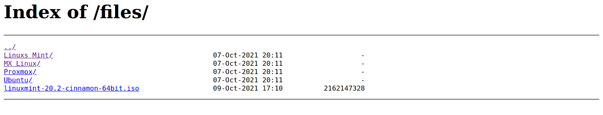
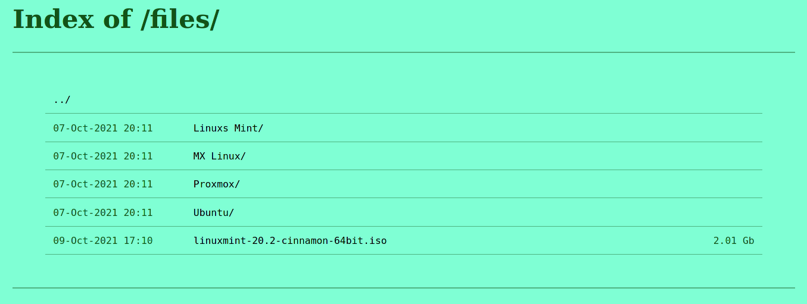

## Style auto index page on Nginx

I was looking for an easy way to add some styling to static assets served directly from Nginx.
I wanted an easy way that does not need to compile Nginx from source everytime there is an update.

The solution requires the "ngx_http_addition_module" which is part of the default options in Nginx published builds.

#### Before


#### After


### Instructions

Example Nginx config
```
server {
    listen 80;
    
    root /var/www;  # Root directory

    location /files {
        autoindex on;
        autoindex_exact_size on;
        autoindex_format html;
        alias /var/www/files/;
        add_before_body /header.html;
        add_after_body /footer.html;
    }
}
```

Clone this repo to the Nginx root dir
```
cd /var/www
git clone https://github.com/Lyhan/nginx-style-autoindex.git
```

Create symlink to the next files
```
ln -s ./nginx-style-autoindex/footer.html .
ln -s ./nginx-style-autoindex/header.html .
ln -s ./nginx-style-autoindex/.autoindex.css .
ln -s ./nginx-style-autoindex/.autoindex.js .
```

The directory would look like this
```
[jca@jca-desktop www]$ ls -lah
total 16K
drwxr-xr-x  4 jca  root 4,0K Oct 10 17:57 .
drwxr-xr-x 14 root root 4,0K Oct  9 23:27 ..
lrwxrwxrwx  1 jca  jca    36 Oct 10 17:12 .autoindex.css -> nginx-style-autoindex/.autoindex.css
lrwxrwxrwx  1 jca  jca    35 Oct 10 17:12 .autoindex.js -> nginx-style-autoindex/.autoindex.js
drwxr-xr-x  4 http http 4,0K Oct 10 17:32 files
lrwxrwxrwx  1 jca  jca    33 Oct 10 17:12 footer.html -> nginx-style-autoindex/footer.html
lrwxrwxrwx  1 jca  jca    33 Oct 10 17:12 header.html -> nginx-style-autoindex/header.html
drwxr-xr-x  3 jca  jca  4,0K Oct 10 17:56 nginx-style-autoindex

```

Restart Nginx
```
systemctl restart nginx
```

To change the styling just modify .autoindex.css